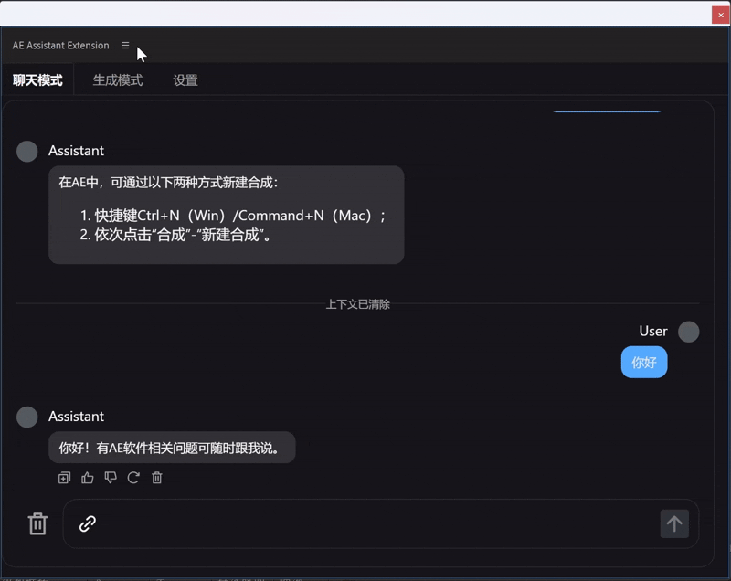
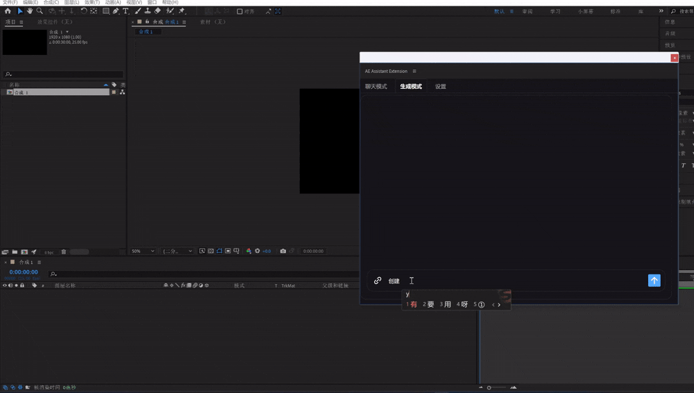

# AEAssistant

## 简介
AEAssistant 是一个用于 After Effects 的辅助工具，借助大语言模型，帮助用户更高效地使用 After Effects 软件。
| 对话模式 | 生成模式 |
| ---- | ---- |
|  |  |

## 主要功能
1. **AI 问题解答**：用户在使用 After Effects 过程中遇到问题，可以向工具提问，获取专业、简洁的解决方案。
2. **AI 脚本操作**：用户可以输入需求，工具会调用 AI 生成符合 ECMAScript 3 标准的 ExtendScript 代码并运行，可实现用语言操作工程。


## 安装与使用
### 安装
克隆仓库并安装依赖：
```bash
git clone <仓库地址>
cd AEAssistant
npm install
```

## WIP
持续更新中...